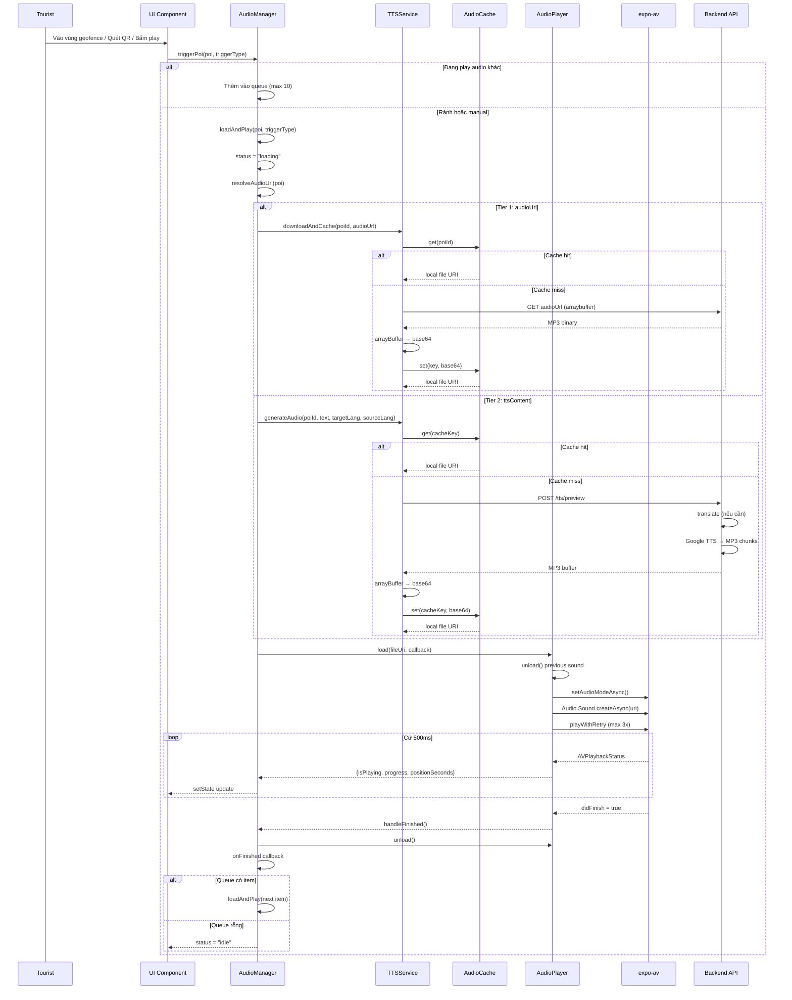

# Luồng phát Audio POI - Phân tích chi tiết

## 1. Kiến trúc tổng thể

```
┌─────────────────────────────────────────────────────────┐
│                    Mobile App (Tourist)                  │
│                                                          │
│  ┌──────────┐   ┌──────────────┐   ┌───────────────┐    │
│  │ UI Layer │──▶│ AudioManager │──▶│  AudioPlayer  │    │
│  │ (React)  │   │  (Orchestr.) │   │ (expo-av)     │    │
│  └──────────┘   └──────┬───────┘   └───────────────┘    │
│                        │                                │
│               ┌────────┴────────┐                       │
│               │                 │                       │
│        ┌──────▼──────┐  ┌──────▼──────┐                │
│        │ TTSService  │  │ AudioCache  │                │
│        │ (generate)  │  │ (local FS)  │                │
│        └──────┬──────┘  └─────────────┘                │
│               │                                         │
└───────────────┼─────────────────────────────────────────┘
                │ HTTP (axios)
                ▼
┌───────────────────────────────┐
│      Backend API              │
│  ┌───────────────────────┐    │
│  │ POST /tts/preview     │    │
│  │ (translate + TTS)     │    │
│  └───────────────────────┘    │
└───────────────────────────────┘
```

**Singleton pattern**: Mỗi component chỉ có 1 instance — `audioManager`, `ttsService`, `audioPlayer`, `audioCache`.

---

## 2. Audio State Machine

```
[idle] ──triggerPoi──▶ [loading] ──load OK──▶ [playing]
  ▲                       │                      │
  │                       │ error                │ pause
  │                       ▼                      ▼
  │                    [error]               [paused]
  │                       │                      │
  │                 clearError             play()/resume
  │                       │                      │
  └───────────────────────┘                      │
  │                                        stop()/finished
  │                                              │
  └──────────────────────────────────────────────┘
```

**AudioState** ([audio.types.ts:31-50](../mobile/src/types/audio.types.ts#L31-L50)):

| Field | Type | Mô tả |
|-------|------|-------|
| activePoi | PoiDetail \| null | POI đang phát |
| status | AudioStatus | idle / loading / playing / paused / stopped / error |
| progress | number (0-1) | Tiến trình phát |
| positionSeconds | number | Vị trí hiện tại (giây) |
| durationSeconds | number | Tổng thời lượng (giây) |
| queue | AudioQueueItem[] | Hàng đợi FIFO (max 10) |
| errorMessage | string \| null | Lỗi hiển thị |
| cooldownUntilMs | number \| null | Thời điểm hết cooldown |
| playedPoiIds | string[] | POI đã phát (anti-duplicate) |

---

## 3. Trigger Types

```typescript
type TriggerType = "proximity" | "manual" | "qr";
```

| Trigger | Kích hoạt | Cooldown | Hành vi |
|---------|-----------|----------|---------|
| **proximity** | Vào bán kính geofence | Không (1 lần/session) | Auto-play, thêm vào playedPoiIds |
| **manual** | User bấm nút trên UI | Không | Play ngay hoặc thêm vào queue |
| **qr** | Quét mã QR | Có (mặc định 30s) | Set cooldown sau khi play thành công |

---

## 4. Luồng phát chi tiết

### 4.1 Entry point: `triggerPoi()` ([AudioManager.ts:213-239](../mobile/src/services/audio/AudioManager.ts#L213-L239))

```
triggerPoi(poi, triggerType)
  │
  ├─ Check cooldown: nếu proximity/qr + đang cooldown → RETURN (no-op)
  │
  ├─ Đang play audio khác?
  │   ├─ Cùng POI → bỏ qua (đang play rồi)
  │   └─ Khác POI → thêm vào queue (max 10 items)
  │
  └─ Gọi loadAndPlay(poi, triggerType)
```

### 4.2 Core: `loadAndPlay()` ([AudioManager.ts:146-211](../mobile/src/services/audio/AudioManager.ts#L146-L211))

```
loadAndPlay(poi, triggerType)
  │
  ├─ Guard: isProcessing? → RETURN (chống concurrent)
  ├─ Set isProcessing = true
  ├─ Set status = "loading"
  │
  ├─ resolveAudioUri(poi)  ← Fallback chain (xem §5)
  │
  ├─ audioPlayer.load(fileUri, callback)  ← expo-av
  │   ├─ Unload audio trước đó
  │   ├─ Set Audio mode (Android focus, iOS silent mode)
  │   ├─ Audio.Sound.createAsync(uri, options)
  │   └─ playWithRetry (max 3 lần, 300ms delay)
  │
  ├─ Set status = "playing"
  ├─ Nếu triggerType = "qr" → set cooldown
  │
  ├─ logPlayHistory()  ← Analytics (placeholder)
  │
  └─ finally: isProcessing = false
```

### 4.3 Progress tracking (realtime callback)

```
audioPlayer → handleStatusUpdate (cứ 500ms)
  │
  ├─ didFinish = true → handleFinished()
  │   ├─ Unload audio
  │   ├─ Queue có item? → auto-play next
  │   └─ Queue rỗng? → status = "idle"
  │
  └─ isPlaying/paused → update progress, position, duration
```

---

## 5. Audio Resolution - Fallback Chain ([AudioManager.ts:105-140](../mobile/src/services/audio/AudioManager.ts#L105-L140))

Đây là logic cốt lõi quyết định nguồn audio:

```
resolveAudioUri(poi)
  │
  ├─ Device language: expo-localization → "vi" | "en" | "zh" | ...
  ├─ Content language: poiAudio[0].languageCode → thường là "vi"
  │
  │
  ├── Tier 1: audioUrl (pre-recorded file) ──────────────────
  │   ├─ ttsService.downloadAndCache(poiId, audioUrl)
  │   ├─ Cache hit? → return local file URI
  │   ├─ Cache miss? → download → base64 → save to disk → return URI
  │   └─ Error? → fall through to Tier 2
  │
  ├── Tier 2: ttsContent (text-to-speech) ───────────────────
  │   ├─ ttsService.generateAudio(poiId, ttsContent, deviceLang, contentLang)
  │   ├─ Backend nhận: text + targetLanguage + sourceLanguage
  │   ├─ Backend xử lý: translate (nếu cần) → TTS → MP3 buffer
  │   └─ Mobile nhận: arraybuffer → base64 → cache → return URI
  │
  └── Tier 3: fallback text ──────────────────────────────────
      ├─ Sử dụng: poi.description ?? poi.name
      ├─ ttsService.generateAudio(poiId, fallbackText)
      └─ Same flow như Tier 2
```

### Quy tắc ngôn ngữ

| Device Lang | Source Lang | Target Lang | Hành vi |
|-------------|-------------|-------------|---------|
| vi | vi | vi | Không dịch, TTS tiếng Việt |
| en | vi | en | Dịch vi→en, TTS tiếng Anh |
| zh | vi | zh | Dịch vi→zh, TTS tiếng Trung |

---

## 6. TTSService - Backend TTS Integration ([TTSService.ts](../mobile/src/services/audio/TTSService.ts))

### 6.1 Cache Strategy

```
Cache Key = "poi_{poiId}_{targetLang}_{sourceLang}_{contentHash}"

Cache Hit  → return local file URI immediately (no network)
Cache Miss → POST /tts/preview → save to disk → return URI
```

- **Content hash**: djb2 hash của `ttsText` → khi backend cập nhật nội dung → hash khác → cache miss → audio mới
- **Cache version**: Mỗi lần thay đổi cache key format, increment `CACHE_VERSION` → tự động clear cache cũ
- **TTL**: 1 giờ (DEFAULT_TTL_MS)
- **Storage**: `expo-file-system` cache directory `/audio-cache/`

### 6.2 API Call

```
POST /tts/preview
Body: {
  text: string,             // Nội dung gốc (Vietnamese)
  previewLanguage: string,  // Ngôn ngữ mục tiêu (e.g. "en")
  sourceLanguage: string    // Ngôn ngữ nguồn (e.g. "vi")
}
Response: MP3 binary (arraybuffer)
```

### 6.3 Cache Migration ([TTSService.ts:42-64](../mobile/src/services/audio/TTSService.ts#L42-L64))

```
App khởi động → check .cache-version file
  ├─ version < CACHE_VERSION → clearAll() → write new version
  └─ version >= CACHE_VERSION → skip (cache OK)
```

---

## 7. AudioCache - Local Storage ([AudioCache.ts](../mobile/src/services/audio/AudioCache.ts))

### 7.1 Two-tier cache

```
┌──────────────────────────┐
│    In-Memory (Map)       │ ← Fast lookup, process-lifetime
│    key → {fileUri, ttl}  │
└────────────┬─────────────┘
             │ miss
             ▼
┌──────────────────────────┐
│    File System           │ ← Persistent across app launches
│    /audio-cache/*.mp3    │
└──────────────────────────┘
```

### 7.2 Cache Operations

| Operation | Logic |
|-----------|-------|
| `get(key)` | Mem cache hit + file exists → return URI; else check disk → rehydrate mem cache |
| `set(key, base64)` | Write file to disk + update mem cache |
| `invalidate(poiId)` | Xóa tất cả cache entries có prefix `poi_{poiId}_` (tất cả ngôn ngữ/hashes) |
| `clearAll()` | Clear mem cache + delete `/audio-cache/` directory |

---

## 8. AudioPlayer - expo-av Wrapper ([AudioPlayer.ts](../mobile/src/services/audio/AudioPlayer.ts))

### 8.1 Thread Safety (Android 15+)

```
Tất cả Audio.Sound operations → runOnMainThread()
  └─ InteractionManager.runAfterInteractions(async () => { ... })
```

**Vấn đề**: Android 15 strict mode — "Player is accessed on the wrong thread" crash.
**Giải pháp**: Dispatch mọi operation qua main UI thread.

### 8.2 Audio Focus Retry ([AudioPlayer.ts:114-139](../mobile/src/services/audio/AudioPlayer.ts#L114-L139))

```
playWithRetry(sound, maxRetries=3, delayMs=300)
  │
  ├─ Attempt 1: sound.playAsync()
  │   ├─ Success → return
  │   └─ AudioFocusError → wait 300ms → retry
  │
  ├─ Attempt 2: sound.playAsync()
  │   ├─ Success → return
  │   └─ AudioFocusError → wait 300ms → retry
  │
  └─ Attempt 3: sound.playAsync()
      ├─ Success → return
      └─ Any error → throw (báo lên AudioManager)
```

### 8.3 Audio Mode Configuration

```typescript
Audio.setAudioModeAsync({
  allowsRecordingIOS: false,      // Không ghi âm
  playsInSilentModeIOS: true,     // Phát khi iPhone tắt âm
  staysActiveInBackground: true,  // Phát khi app vào background
  shouldDuckAndroid: true,        // Giảm âm app khác khi play
  playThroughEarpieceAndroid: false, // Phát qua loa ngoài
})
```

### 8.4 Single Active Audio

Chỉ có 1 `Audio.Sound` instance tại bất kỳ thời điểm nào. `load()` tự động `unload()` sound trước đó.

---

## 9. Queue System

```
triggerPoi(poi) khi đang play audio khác
  │
  ├─ Queue chưa đầy (< 10) + chưa có POI này → thêm vào cuối
  ├─ Queue đã đầy → bỏ qua (silent drop)
  └─ Cùng POI → bỏ qua (anti-duplicate)

handleFinished() khi audio kết thúc
  │
  ├─ Queue rỗng → status = "idle"
  └─ Queue có item → auto-play next (FIFO)

User actions:
  ├─ skipToNext() → stop current, play đầu queue
  ├─ playNow(poiId) → xóa khỏi queue, play ngay
  ├─ removeFromQueue(poiId) → xóa khỏi queue
  └─ clearQueue() → xóa toàn bộ queue
```

---

## 10. Cooldown System

```
Cooldown chỉ áp dụng cho QR trigger:
  ├─ setCooldown(poiId, cooldownMs) → Map<poiId, expiryTimestamp>
  ├─ isInCooldown(poiId) → Date.now() < expiry
  └─ clearCooldowns() → xóa tất cả (tour reset)

Flow:
  triggerPoi(poi, "qr")
    ├─ isInCooldown(poi.id) === true → RETURN (chống spam)
    ├─ Play audio thành công → setCooldown(poi.id, 30s)
    └─ UI hiển thị cooldownUntilMs cho countdown timer
```

---

## 11. Sequence Diagram - Full Audio Playback



---

## 12. Các file liên quan

| File | Vai trò |
|------|---------|
| [AudioManager.ts](../mobile/src/services/audio/AudioManager.ts) | Orchestrator chính: trigger, queue, cooldown, fallback chain |
| [TTSService.ts](../mobile/src/services/audio/TTSService.ts) | Gọi backend TTS, download audio, cache management |
| [AudioCache.ts](../mobile/src/services/audio/AudioCache.ts) | In-memory + filesystem cache cho audio files |
| [AudioPlayer.ts](../mobile/src/services/audio/AudioPlayer.ts) | expo-av wrapper: play, pause, seek, thread safety |
| [audio.types.ts](../mobile/src/types/audio.types.ts) | TypeScript types: AudioState, AudioQueueItem, TriggerType |
| [tts.service.ts](../backend/src/services/tts.service.ts) | Backend: translation + Google TTS generation |
| [tourist/poi.service.ts](../backend/src/services/tourist/poi.service.ts) | Backend: POI detail + multilingual audio resolution |

---

## 13. Ghi chú quan trọng

1. **Single Active Audio**: Chỉ 1 audio phát tại 1 thời điểm — load mới tự unload cũ.
2. **3-tier fallback**: audioUrl → ttsContent → description/name — đảm bảo luôn có audio.
3. **Content-aware cache**: Cache key chứa hash của text → khi nội dung thay đổi → tự động regenerate.
4. **Thread safety**: Tất cả expo-av operations dispatch qua main thread (fix Android 15 crash).
5. **Audio focus retry**: 3 lần retry, 300ms delay cho Android audio focus denial.
6. **Translation cache version**: Khi thay đổi cache key format → increment version → auto-migrate.
7. **Cooldown chỉ cho QR**: Proximity trigger chỉ phát 1 lần/session (qua `playedPoiIds`), QR có cooldown 30s.
8. **Queue FIFO**: Max 10 items, auto-play next khi current finished.
9. **logPlayHistory**: Hiện tại là placeholder cho analytics tương lai.
